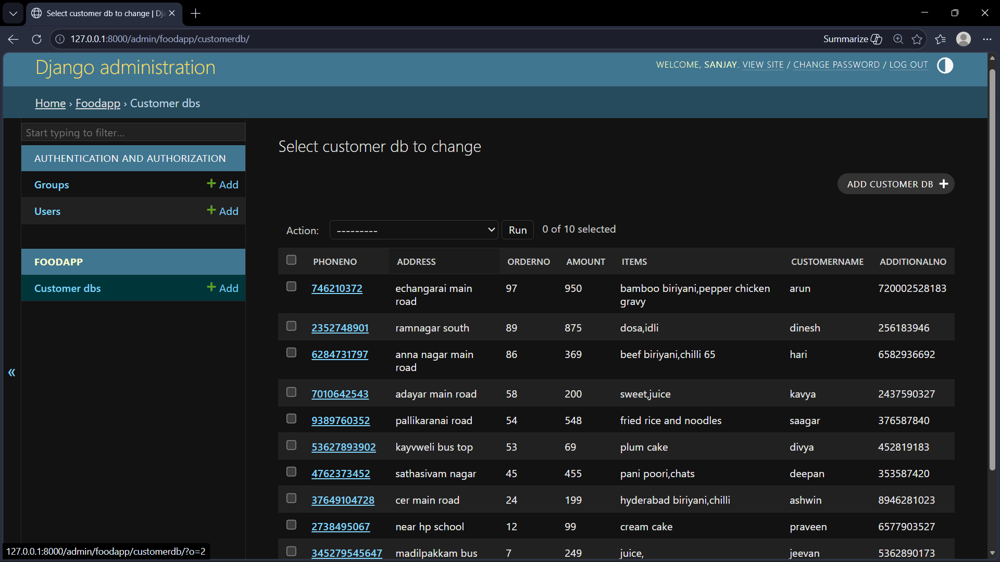

# Ex03 Places Around Me
## Date:10/2/2026

## AIM
To develop a website to display details about the places around my house.

## DESIGN STEPS

### STEP 1
Create a Django admin interface.

### STEP 2
Download your city map from Google as an image.

### STEP 3
Insert the image using `````` tag and link it to the map.

### STEP 4
Using ```<map>``` tag name the map.

### STEP 5
Create clickable regions in the image using ```<area>``` tag.

### STEP 6
Write HTML programs for all the regions identified.

### STEP 7
Execute the programs and publish them.

## CODE
```
model.py
from django.db import models

class CustomerDB(models.Model):
    PhoneNo = models.IntegerField()
    Address = models.CharField(max_length=35)
    OrderNo = models.IntegerField(primary_key=True)
    Amount = models.IntegerField()
    Items = models.CharField(max_length=60)
    CustomerName = models.CharField(max_length=20)
    AdditionalNo = models.IntegerField()

    def __str__(self):
        return self.CustomerName
admin.py
from django.contrib import admin
from .models import CustomerDB

@admin.register(CustomerDB)
class CustomerDBAdmin(admin.ModelAdmin):
    list_display = ['PhoneNo','Address','OrderNo','Amount','Items','CustomerName','AdditionalNo']

```

## OUTPUT 


## RESULT
The program for implementing image maps using HTML is executed successfully.
